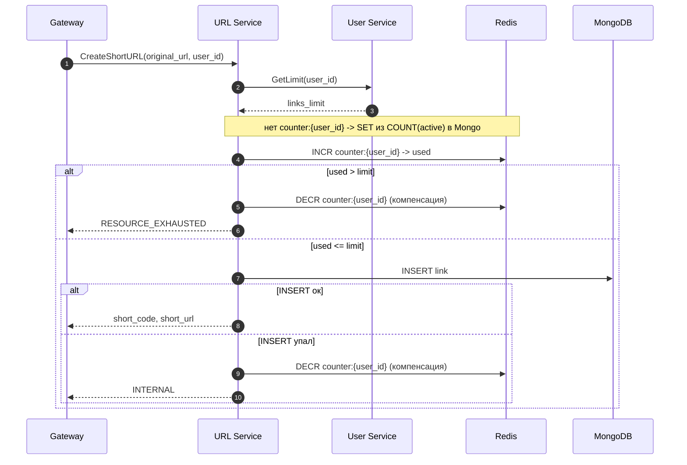

# Неделя 2: URL Service

Вся домашка второй недели в одном файле: карта проекта → контракт → пошаговый план. Опирается на монорепо из первой недели (модули `shared`, `user`, `go.work`, `docker-compose` с Postgres + Redis, настроенный `buf`).

> Boilerplate этой недели лежит в скачанном шаблоне: `../url-shortener-template/week2/boilerplates/` (ниже для краткости — просто `boilerplates/`). Копируешь оттуда в свой репозиторий. Подробнее — в начале проекта, раздел «С чего начать».

## Цель

Создать URL Service — gRPC-сервис для создания, хранения и редиректа коротких ссылок. На создании ссылки реализовать Saga с компенсацией.

---

## Что строим

URL Service:
- хранит ссылки в **MongoDB** (коллекция `links`);
- кеширует горячие ссылки и держит каунтер лимита в **Redis** — это **тот же единственный инстанс Redis**, что и у User Service (отдельный Redis не поднимаем);
- лимит активных ссылок берёт из подписки пользователя через gRPC-вызов `User.GetLimit`;
- при создании ссылки выполняет **Saga**: атомарно учитывает ссылку в каунтере, пишет документ в Mongo, при сбое откатывает каунтер.

**Про `user_id` и авторизацию.** URL Service access-токен не обрабатывает — в запросах приходит уже готовый `user_id` (строкой), и сервис ему доверяет. Проверкой токена занимается Gateway (третья неделя): он достаёт токен из заголовка `Authorization`, валидирует через `User.ValidateSession`, получает `user_id` и кладёт его в gRPC-запрос к URL Service. Снаружи доступен только Gateway, сами сервисы — во внутренней сети. Проверку владельца (`DeleteURL`) делает уже URL Service, сравнивая `user_id` из запроса с владельцем ссылки. `Redirect` — публичный, без `user_id`.

Каунтер `counter:{user_id}` — это число активных ссылок пользователя. Создание ссылки увеличивает его (`INCR`), удаление — уменьшает (`DECR`). Лимит исчерпан, когда каунтер превышает `links_limit` из подписки.

Ключи Redis, которые будешь использовать:

| Ключ | Тип | TTL | Назначение |
|------|-----|-----|-----------|
| `link:{short_code}` | string | LRU (`allkeys-lru`) | кеш `original_url` для редиректа |
| `counter:{user_id}` | каунтер (int) | — | число активных ссылок пользователя |
| `limit:{user_id}` | string | 5 мин | кеш лимита подписки (чтобы реже звать User) |

Поток `CreateShortURL` (его реализуешь в Шаге 5):



---

## Что нужно сделать (пошагово)

Делай шаги по порядку. У каждого в конце — **Проверка**.

Как пользоваться заданием:
- **Код пишешь сам** — `.proto`-контракт и весь Go-код руками. Ответы для самопроверки (если застрял) — в [`answers.md`](answers.md).
- **Команды и конфиги можно копировать** — `buf generate`, docker и т.п.

### Шаг 1. Добавить сервис `url` в монорепо

1. Создай папки и модуль (`yourname` — твой github-логин):
   ```bash
   mkdir -p url/cmd url/internal shared/proto/url/v1
   (cd url && go mod init github.com/yourname/url-shortener/url)
   ```
2. Добавь модуль в `go.work`:
   ```
   use (
       ./user
       ./url
       ./shared
   )
   ```

**Проверка:** `go work sync` без ошибок.

### Шаг 2. Описать `.proto` и сгенерировать код

Создай файл `shared/proto/url/v1/url.proto` и опиши в нём сервис `URLService` с пятью методами по контракту ниже. `.proto` пишешь сам; эталон — в [`answers.md`](answers.md).

В заголовке файла укажи:
- `syntax = "proto3";`
- `package url.v1;`
- `option go_package = "github.com/yourname/url-shortener/shared/pkg/proto/url/v1;url_v1";`

Методы, сообщения запроса/ответа и `URLItem` опиши так:

**CreateShortURL**
- Запрос: `original_url` (string), `user_id` (string), `expires_in` (`optional int64` — через сколько секунд истечёт)
- Ответ: `short_code` (string), `short_url` (string)

**GetURL**
- Запрос: `short_code` (string)
- Ответ: `original_url` (string), `user_id` (string), `created_at` (int64), `expires_at` (int64), `is_active` (bool)

**DeleteURL**
- Запрос: `short_code` (string), `user_id` (string)
- Ответ: пустой

**ListUserURLs**
- Запрос: `user_id` (string), `limit` (int32), `cursor` (string)
- Ответ: `urls` (`repeated URLItem`), `next_cursor` (string)
- `URLItem`: `short_code` (string), `original_url` (string), `created_at` (int64), `expires_at` (int64), `is_active` (bool)

**Redirect**
- Запрос: `short_code` (string)
- Ответ: `original_url` (string)

Сгенерируй код (конфиг buf уже лежит в `shared/proto/` с первой недели):
```bash
make proto-gen        # = cd shared/proto && buf generate
```

**Проверка:** появились `shared/pkg/proto/url/v1/url.pb.go` и `url_grpc.pb.go`; `go build ./...` проходит.

### Шаг 3. Поднять MongoDB и настроить Redis

1. В корневой `docker-compose.yml` добавь новый сервис `mongo` (Redis уже есть с первой недели — второй не поднимаем):
   ```yaml
   mongo:
     image: mongo:7
     ports:
       - "27017:27017"      # порт Mongo на твоей машине : порт внутри контейнера
     volumes:
       - mongo_data:/data/db   # чтобы данные не пропадали при перезапуске
   ```
   и добавь `mongo_data:` в секцию `volumes:` в конце файла (рядом с `postgres_data`).
2. Открой уже существующий сервис `redis` и добавь ему команду запуска с политикой вытеснения (LRU) — она нужна, чтобы Redis сам удалял редко используемые ключи кеша ссылок, когда упрётся в лимит памяти:
   ```yaml
   redis:
     image: redis:7-alpine
     command: ["redis-server", "--maxmemory", "256mb", "--maxmemory-policy", "allkeys-lru"]
     ports:
       - "6379:6379"
   ```
3. Подними всё: `make up`.

**Проверка** (через `docker compose exec` — локально `mongosh`/`redis-cli` ставить не нужно):
```bash
docker compose ps                                                 # postgres, redis, mongo — running
docker compose exec redis redis-cli CONFIG GET maxmemory-policy   # -> allkeys-lru
docker compose exec mongo mongosh --eval 'db.runCommand({ping:1})'  # -> ok: 1
```

### Шаг 4. Конфиг и подключения

Сервис не должен содержать «зашитых» адресов и паролей — все настройки он берёт из переменных окружения (env). У каждого сервиса **свой** файл `.env` (как `user/.env` у User Service). Создай `url/.env` (шаблон — `boilerplates/url/.env.template`):

```env
# --- URL Service (url/.env) ---

# MongoDB: строка подключения и имя базы
MONGO_URI=mongodb://localhost:27017
MONGO_DB=url_shortener

# Redis: тот же инстанс, что и у User Service (хост и порт)
REDIS_HOST=localhost
REDIS_PORT=6379

# Адрес gRPC-сервера User Service — куда стучаться за GetLimit.
# Это host:port, на котором слушает User Service (его порт из первой недели).
USER_SERVICE_ADDR=localhost:50051

# Порт, на котором будет слушать сам URL Service (gRPC)
URL_SERVICE_PORT=50052

# База для сборки короткой ссылки в ответе CreateShortURL:
# из неё + "/" + short_code получается поле short_url
SHORT_URL_BASE=https://short.url
```

Что значит каждая переменная:

| Переменная | Что это | Пример |
|------------|---------|--------|
| `MONGO_URI` | строка подключения к MongoDB (схема `mongodb://хост:порт`) | `mongodb://localhost:27017` |
| `MONGO_DB` | имя базы данных внутри Mongo | `url_shortener` |
| `REDIS_HOST` | хост Redis | `localhost` |
| `REDIS_PORT` | порт Redis | `6379` |
| `USER_SERVICE_ADDR` | адрес gRPC-сервера User Service (host:port), куда URL Service шлёт `GetLimit` | `localhost:50051` |
| `URL_SERVICE_PORT` | порт, на котором слушает сам URL Service | `50052` |
| `SHORT_URL_BASE` | начало короткой ссылки; к нему приклеивается `/short_code` | `https://short.url` |

> Порты `50051` (User) и `50052` (URL) разные, потому что это два отдельных процесса на одной машине — они не могут слушать один порт. Числа из диапазона 50051+ — общепринятые для локальных gRPC-сервисов, но подойдут любые свободные.

Сделай пакет `url/internal/config` со структурой `Config` и функцией `Load() (*Config, error)` — по тому же принципу, что в первой неделе:
- `godotenv.Load("url/.env")` подгружает файл в окружение (Go сам его не читает);
- читаешь переменные через `os.Getenv`, обязательные проверяешь на пустоту;
- `REDIS_HOST` + ":" + `REDIS_PORT` собираешь в одно поле-адрес;
- возвращаешь заполненный `*Config`.

Сами подключения к Mongo/Redis и gRPC-клиент к User создаются уже в `main.go` из этого конфига (Шаг 7).

**Проверка:** `config.Load()` отдаёт заполненный конфиг; при отсутствии обязательной переменной — внятная ошибка.

### Шаг 5. Коллекция `links` и индексы

Создай при старте сервиса коллекцию `links` со следующими полями:

| Поле | Тип | Описание |
|------|-----|----------|
| _id | ObjectId | id Mongo (используется как курсор пагинации) |
| short_code | string | короткий код |
| original_url | string | исходный URL |
| user_id | string | UUID владельца |
| created_at | ISODate | дата создания |
| updated_at | ISODate | дата обновления |
| expires_at | ISODate | дата истечения (нет поля — бессрочно) |
| is_active | bool | активна ли ссылка |

Создай три индекса:
- по `short_code` — **unique**;
- по `user_id` — обычный;
- по `expires_at` — **TTL** (`expireAfterSeconds: 0` — Mongo сама удалит документ, когда `expires_at` окажется в прошлом).

Индексы создаются из Go при старте сервиса (идемпотентно — повторный вызов ничего не ломает):
```go
_, err := coll.Indexes().CreateMany(ctx, []mongo.IndexModel{
    {Keys: bson.D{{Key: "short_code", Value: 1}}, Options: options.Index().SetUnique(true)},
    {Keys: bson.D{{Key: "user_id", Value: 1}}},
    {Keys: bson.D{{Key: "expires_at", Value: 1}}, Options: options.Index().SetExpireAfterSeconds(0)},
})
```

**Проверка:**
```bash
docker compose exec mongo mongosh url_shortener --eval 'db.links.getIndexes()'   # три индекса
```

### Шаг 6. Реализовать методы

Слои как в первой неделе — каждый со своим конструктором `New...(зависимости)`, сшиваются в `main.go` (Шаг 7):
```
url/internal/
├── config/       # Config + Load()
├── handler/      # gRPC-обработчики
├── service/      # бизнес-логика (Saga) + интерфейсы repository/cache/client
├── repository/   # MongoDB
├── cache/        # Redis (кеш ссылок + каунтер)
└── client/       # gRPC-клиент к User Service (GetLimit)
```
Интерфейсы того, что нужно service-слою (репозиторий, кеш, клиент User), объявляет сам `service`; реализации передаются в `service.New(repo, cache, client)`. Бизнес-логику (методы ниже) пиши в service-слое.

**CreateShortURL** (Saga, по диаграмме выше):
1. Проверь, что `original_url` начинается с `http://` или `https://`. Иначе → `INVALID_ARGUMENT`.
2. Получи лимит: `client.GetLimit(user_id)` (через кеш `limit:{user_id}`, 5 мин). Если User Service недоступен → `UNAVAILABLE`.
3. Если ключа `counter:{user_id}` нет в Redis — посчитай `COUNT` активных ссылок пользователя в Mongo и запиши в `counter:{user_id}`.
4. `used = INCR counter:{user_id}`.
5. Если `used > limit` → `DECR counter:{user_id}` и верни `RESOURCE_EXHAUSTED`.
6. Сгенерируй `short_code`: 7 символов base62 из случайных байт. Если задан `expires_in` — посчитай `expires_at = now + expires_in` секунд.
7. Вставь документ в Mongo. Если `short_code` уже занят (ошибка unique-индекса) — сгенерируй заново, до 3 попыток.
8. Если вставка не удалась → `DECR counter:{user_id}` и верни `INTERNAL`.
9. Верни `short_code` и `short_url = SHORT_URL_BASE + "/" + short_code`.

**GetURL:**
1. Найди документ в Mongo по `short_code`.
2. Если нет, или `is_active = false`, или `expires_at` в прошлом → `NOT_FOUND`.
3. Верни поля документа.

**DeleteURL:**
1. Найди документ по `short_code`. Нет → `NOT_FOUND`.
2. Если `user_id` не совпадает с владельцем → `PERMISSION_DENIED`.
3. Удали документ из Mongo.
4. `DEL link:{short_code}` в Redis.
5. `DECR counter:{user_id}`.

**ListUserURLs:**
1. Запрос в Mongo: `user_id = ?`, сортировка по `_id` по возрастанию, если задан `cursor` — условие `_id > cursor`, лимит `limit + 1` (по умолчанию `limit = 20`, максимум 100).
2. Если вернулось `limit + 1` документов — есть следующая страница: верни первые `limit`, а `next_cursor` = `_id` последнего из них. Иначе `next_cursor` пустой.

**Redirect:**
1. `GET link:{short_code}` в Redis.
2. Промах — найди в Mongo, проверь `is_active`/`expires_at`, запиши `original_url` в `link:{short_code}`.
3. Нет или неактивна → `NOT_FOUND`.
4. Верни `original_url`.

**Проверка** (через `grpcurl`; подними и User, и URL сервисы, а `user_id` возьми реальный — зарегистрируй пользователя в User Service):
```bash
grpcurl -plaintext -d '{"original_url":"https://example.com","user_id":"<uuid>"}' \
  localhost:50052 url.v1.URLService/CreateShortURL
grpcurl -plaintext -d '{"short_code":"<код из ответа>"}' \
  localhost:50052 url.v1.URLService/Redirect
```
Так же проверь `GetURL`, `DeleteURL`, `ListUserURLs`.

### Шаг 7. Сборка в main.go, сервер, тесты

`cmd/main.go` — composition root: создаёшь конкретные реализации и прокидываешь друг в друга. Собери снизу вверх:
1. `cfg, err := config.Load()`.
2. Подключения из конфига:
   - **MongoDB** (`go.mongodb.org/mongo-driver/v2/mongo`): `mongo.Connect(...)` с `cfg.MongoURI`, база `cfg.MongoDB`, коллекция `links`; `client.Ping(...)`.
   - **Redis** (`github.com/redis/go-redis/v9`): `redis.NewClient(&redis.Options{Addr: cfg.RedisAddr})` — тот же общий инстанс; `Ping`.
   - **gRPC-клиент к User**: `grpc.NewClient(cfg.UserServiceAddr, grpc.WithTransportCredentials(insecure.NewCredentials()))`, оберни в `userv1.NewUserServiceClient(conn)`. (`insecure` — сервисы общаются во внутренней сети без TLS.)
3. `repo := repository.New(mongoCollection)`, `cache := cache.New(rdb)`, `userClient := client.New(grpcUserClient)`.
4. `svc := service.New(repo, cache, userClient, cfg.ShortURLBase)`.
5. `h := handler.New(svc)`.
6. `grpcServer := grpc.NewServer()`; зарегистрируй `urlv1.RegisterURLServiceServer(grpcServer, h)`; включи `reflection.Register(grpcServer)` (иначе `grpcurl` не увидит методы); `net.Listen("tcp", ":"+cfg.GRPCPort)` + `grpcServer.Serve(lis)`; graceful shutdown по SIGINT/SIGTERM (закрой Mongo, Redis, gRPC-conn).

`handler` реализует сгенерированный `URLServiceServer` (импорт `…/shared/pkg/proto/url/v1`): вызывает service, мапит доменные ошибки в gRPC-коды (`RESOURCE_EXHAUSTED`, `INVALID_ARGUMENT`, `NOT_FOUND`, `PERMISSION_DENIED`, `UNAVAILABLE`, иначе `INTERNAL`).

Тесты на service-слой (моки `repository`/`cache`/`client` через mockery), минимум 3: CreateShortURL успех; лимит исчерпан (`RESOURCE_EXHAUSTED`, каунтер откатился); сбой вставки в Mongo (каунтер откатился).

> `make run`/`make test` из первой недели запускают/тестируют **User Service**. URL Service запускай `go run ./url/cmd`, тесты — `go test -race ./url/...`. Удобно добавить в Makefile таргеты `run-url`/`test-url` (на третьей неделе это формализуем).

**Проверка:** `go run ./url/cmd` стартует URL Service (предварительно подними User Service — он нужен для `GetLimit`); `go test -race ./url/...` зелёный.

---

## Чек-лист

- [ ] `make up` поднимает Postgres + Redis + MongoDB (Redis — один инстанс на User и URL)
- [ ] `make proto-gen` генерирует код из `shared/proto/url/v1/url.proto`
- [ ] CreateShortURL: Saga с атомарным `INCR` до вставки и компенсацией `DECR` при сбое
- [ ] Лимит проверяется через каунтер + `User.GetLimit`; User недоступен → `UNAVAILABLE`
- [ ] Каунтер: create → `INCR`, delete → `DECR`; при отсутствии ключа пересчитывается из Mongo `COUNT`
- [ ] GetURL читает Mongo, проверяет `is_active`/`expires_at`
- [ ] DeleteURL проверяет владельца, чистит кеш, делает `DECR`
- [ ] ListUserURLs отдаёт cursor-based пагинацию
- [ ] Redirect идёт Redis → Mongo, прогревает кеш
- [ ] MongoDB: unique-индекс на `short_code`, TTL-индекс на `expires_at`
- [ ] Redis: `allkeys-lru`
- [ ] Unit-тесты проходят (`make test`)

## Подсказки

- MongoDB-драйвер: `go.mongodb.org/mongo-driver/v2/mongo`
- base62: `github.com/jxskiss/base62` или своя реализация на `crypto/rand`
- Пагинация: cursor-based через `_id > last_id`
- gRPC-клиент к User Service: адрес из env `USER_SERVICE_ADDR`
