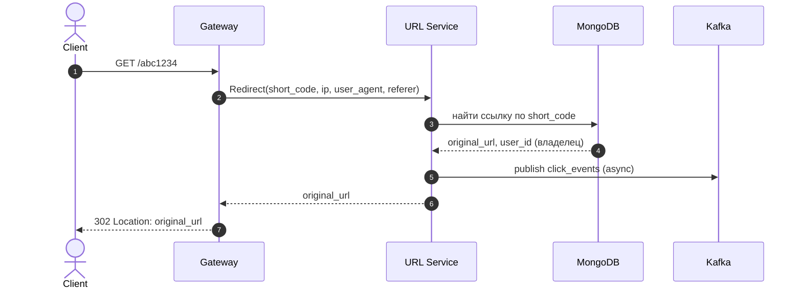

# Неделя 3: API Gateway + Kafka + интеграция

Вся домашка третьей недели в одном файле: карта → REST-контракт → пошаговый план. Опирается на монорепо первых двух недель (модули `shared`, `user`, `url`; Postgres, Redis, MongoDB в `docker-compose`; настроенный `buf`).

> Boilerplate этой недели лежит в скачанном шаблоне: `../url-shortener-template/week3/boilerplates/` (ниже для краткости — просто `boilerplates/`). Копируешь оттуда в свой репозиторий. Подробнее — в начале проекта, раздел «С чего начать».

## Цель

Создать **API Gateway** — REST-сервис на chi, единственную публичную точку входа. Подключить **Kafka**: при редиректе URL Service отправляет click event. Написать интеграционные тесты на полный сценарий.

---

## Что строим

- **Gateway** — REST на `chi`, слушает `:8080`, наружу торчит только он. Принимает HTTP, на защищённых ручках валидирует токен через `User.ValidateSession`, дальше проксирует в `User`/`URL` по gRPC. Сам JWT-секрет не знает.
- **Kafka** — topic `click_events`. **Producer — в URL Service**: при каждом редиректе он шлёт событие клика. Consumer появится на четвёртой неделе (Analytics).
- Click event несёт `ip`, `user_agent`, `referer` — а их видит только Gateway (HTTP-заголовки). Поэтому Gateway прокидывает их в gRPC-метод `Redirect`, а URL Service публикует событие.

Поток редиректа:



Маршруты Gateway (подробности — в REST-контракте ниже):

| Метод + путь | Авторизация | Куда проксирует |
|--------------|-------------|-----------------|
| `POST /api/v1/auth/register` | нет | `User.Register` |
| `POST /api/v1/auth/login` | нет | `User.Login` |
| `POST /api/v1/auth/refresh` | нет | `User.RefreshToken` |
| `POST /api/v1/auth/logout` | да | `User.Logout` |
| `POST /api/v1/urls` | да | `URL.CreateShortURL` |
| `GET /api/v1/urls` | да | `URL.ListUserURLs` |
| `DELETE /api/v1/urls/{code}` | да | `URL.DeleteURL` |
| `GET /{code}` | нет (публичный) | `URL.Redirect` |

**Как работает авторизация.** На защищённых ручках стоит middleware: он читает заголовок `Authorization: Bearer <access>`, зовёт `User.ValidateSession(access)` по gRPC и кладёт `user_id` + `session_id` из ответа в контекст запроса. Хендлеры берут их оттуда. Если `ValidateSession` вернул ошибку — middleware отдаёт `401`. Gateway сам токен не декодит и секрет не знает.

---

## REST-контракт

Base URL: `http://localhost:8080`. Тела — JSON. Защищённые ручки требуют заголовок `Authorization: Bearer <access_token>`.

### POST /api/v1/auth/register
- Тело: `{ "email": "...", "password": "..." }`
- Ответ `201`: `{ "user_id": "..." }`
- Ошибки: `409` (email занят), `400` (невалидный email / короткий пароль)
- Проксирует в `User.Register`.

### POST /api/v1/auth/login
- Тело: `{ "email": "...", "password": "..." }`
- Ответ `200`: `{ "access_token": "eyJ...", "refresh_token": "eyJ..." }` (оба — JWT)
- Ошибки: `401` (неверный логин/пароль)
- Проксирует в `User.Login`.

### POST /api/v1/auth/refresh
- Тело: `{ "refresh_token": "eyJ..." }`
- Ответ `200`: `{ "access_token": "eyJ..." }`
- Ошибки: `401` (refresh невалиден/просрочен/сессия отозвана)
- Проксирует в `User.RefreshToken`. Авторизация не нужна (access уже истёк).

### POST /api/v1/auth/logout (авторизация)
- Ответ `200`: `{}`
- middleware кладёт `session_id` в контекст → хендлер зовёт `User.Logout(session_id)`.

### POST /api/v1/urls (авторизация)
- Тело: `{ "original_url": "...", "expires_in": 2592000 }` (`expires_in` опционально, секунды)
- Ответ `201`: `{ "short_code": "abc1234", "short_url": "https://short.url/abc1234" }`
- Ошибки: `400` (невалидный URL), `429` (лимит исчерпан), `401`
- `user_id` берётся из контекста (от middleware) → `URL.CreateShortURL(original_url, user_id, expires_in)`.
- При `429` опционально добавь заголовки `X-RateLimit-Limit` и `X-RateLimit-Remaining` (если URL вернёт числа). Заголовков со сбросом по времени нет — лимит освобождается удалением ссылки, а не по таймеру.

### GET /api/v1/urls (авторизация)
- Query: `limit` (по умолчанию 20, макс 100), `cursor`
- Ответ `200`: `{ "urls": [ { "short_code", "original_url", "created_at", "expires_at", "is_active" } ], "next_cursor": "..." }`
- `created_at`/`expires_at` Gateway отдаёт строкой ISO-8601 (конвертирует из unix-времени gRPC-ответа).
- Проксирует в `URL.ListUserURLs(user_id, limit, cursor)`.

### DELETE /api/v1/urls/{code} (авторизация)
- Ответ `204` (без тела)
- Ошибки: `404` (нет ссылки), `403` (не владелец), `401`
- Проксирует в `URL.DeleteURL(short_code, user_id)`.

### GET /{code} (публичный)
- Ответ `302 Found`, заголовок `Location: <original_url>`
- Ошибки: `404` (нет или неактивна)
- Gateway достаёт `ip` (из `X-Forwarded-For`/`RemoteAddr`), `user_agent`, `referer` из запроса и зовёт `URL.Redirect(short_code, ip, user_agent, referer)`. Побочный эффект — click event в Kafka (шлёт URL Service).

### GET /api/v1/analytics/{code} (авторизация, на четвёртой неделе)
Появится на четвёртой неделе вместе с Analytics Service.

### Маппинг ошибок gRPC → HTTP

Хендлеры получают от сервисов gRPC-ошибки с кодом (`status.Code(err)`) и переводят их в HTTP-статус:

| gRPC-код | HTTP |
|----------|------|
| `OK` | 200/201/204 |
| `InvalidArgument` | 400 |
| `Unauthenticated` | 401 |
| `PermissionDenied` | 403 |
| `NotFound` | 404 |
| `AlreadyExists` | 409 |
| `ResourceExhausted` | 429 |
| `Unavailable` | 503 |
| иначе | 500 |

---

## Что нужно сделать (пошагово)

Как пользоваться: код пишешь сам; команды/конфиги (docker, buf) можно копировать. Ответы для самопроверки (когда застрял) — в [`answers.md`](answers.md).

### Шаг 1. Добавить сервис `gateway` в монорепо

1. Создай модуль:
   ```bash
   mkdir -p gateway/cmd gateway/internal
   (cd gateway && go mod init github.com/yourname/url-shortener/gateway)
   ```
2. Добавь `./gateway` в `go.work`.
3. Скопируй `boilerplates/gateway/.env.template` → `gateway/.env`.

**Проверка:** `go work sync` без ошибок.

### Шаг 2. Поднять Kafka

1. Добавь в корневой `docker-compose.yml` сервис Kafka (KRaft mode, без ZooKeeper):
   ```yaml
   kafka:
     image: apache/kafka:3.8.0
     ports:
       - "9092:9092"
     environment:
       KAFKA_NODE_ID: 1
       KAFKA_PROCESS_ROLES: broker,controller
       KAFKA_LISTENERS: PLAINTEXT://:9092,CONTROLLER://:9093
       KAFKA_ADVERTISED_LISTENERS: PLAINTEXT://localhost:9092
       KAFKA_CONTROLLER_QUORUM_VOTERS: 1@localhost:9093
       KAFKA_CONTROLLER_LISTENER_NAMES: CONTROLLER
       KAFKA_LISTENER_SECURITY_PROTOCOL_MAP: CONTROLLER:PLAINTEXT,PLAINTEXT:PLAINTEXT
       KAFKA_OFFSETS_TOPIC_REPLICATION_FACTOR: 1
       KAFKA_TRANSACTION_STATE_LOG_REPLICATION_FACTOR: 1
       KAFKA_TRANSACTION_STATE_LOG_MIN_ISR: 1
   ```
2. `make up` поднимет всё (Postgres, Redis, Mongo, Kafka).

Топик `click_events` создавать руками не обязательно — в образе `apache/kafka` авто-создание топиков включено, он появится при первой записи. Хочешь создать заранее:
```bash
docker compose exec kafka /opt/kafka/bin/kafka-topics.sh \
  --bootstrap-server localhost:9092 --create --if-not-exists --topic click_events
```

**Проверка:** `docker compose ps` показывает `kafka` running; команда смотрит список топиков:
```bash
docker compose exec kafka /opt/kafka/bin/kafka-topics.sh --bootstrap-server localhost:9092 --list
```

### Шаг 3. Расширить контракт `Redirect` под click event

В `shared/proto/url/v1/url.proto` добавь в `RedirectRequest` три поля (нумеруй дальше — добавление полей обратно совместимо):
- `ip` (string), `user_agent` (string), `referer` (string)

`RedirectResponse` не меняется. Перегенерируй: `make proto-gen`. Эталон — в [`answers.md`](answers.md).

**Проверка:** в `shared/pkg/proto/url/v1/url.pb.go` у `RedirectRequest` появились новые поля; `go build ./...` проходит.

### Шаг 4. Kafka producer в URL Service

1. Добавь в `url/.env` адрес брокера: `KAFKA_BROKERS=localhost:9092` (и в `config`).
2. Сделай в URL Service producer (`github.com/segmentio/kafka-go`): он пишет JSON-сообщения в topic `click_events`. Producer создаётся один раз в `main.go` и прокидывается в service-слой:
   ```go
   w := &kafka.Writer{
       Addr:  kafka.TCP(cfg.KafkaBrokers...),  // из KAFKA_BROKERS
       Topic: "click_events",
   }
   // публикация одного события:
   err := w.WriteMessages(ctx, kafka.Message{Value: jsonBytes})
   ```
3. В методе `Redirect` после того, как нашёл ссылку, **асинхронно** (в отдельной горутине, не блокируя ответ) опубликуй событие. Ошибку записи логируй, но клиенту не возвращай — редирект важнее, чем доставка аналитики:
   ```json
   {
     "short_code": "abc1234",
     "user_id": "<владелец ссылки>",
     "clicked_at": "2026-01-15T14:32:00Z",
     "ip": "185.86.151.42",
     "user_agent": "Mozilla/5.0 ...",
     "referer": "https://t.me/..."
   }
   ```
   `user_id` — владелец ссылки (URL Service знает его из документа), `clicked_at` — текущее время, остальное — из аргументов `Redirect`.

**Проверка:** после `GET /{code}` сообщение появляется в `click_events`:
```bash
docker compose exec kafka /opt/kafka/bin/kafka-console-consumer.sh \
  --bootstrap-server localhost:9092 --topic click_events --from-beginning
```

### Шаг 5. Конфиг Gateway (свой пакет `config`)

`gateway/.env`:

| Переменная | Что это | Пример |
|------------|---------|--------|
| `GATEWAY_PORT` | порт HTTP-сервера Gateway | `8080` |
| `USER_SERVICE_ADDR` | адрес gRPC User Service | `localhost:50051` |
| `URL_SERVICE_ADDR` | адрес gRPC URL Service | `localhost:50052` |

Сделай пакет `gateway/internal/config` со структурой `Config` и `Load()` (godotenv + os.Getenv + проверка обязательных), как в прошлых неделях. JWT-секрет Gateway НЕ нужен — он не валидирует токен локально.

**Проверка:** `config.Load()` отдаёт заполненный конфиг.

### Шаг 6. Слои Gateway и gRPC-клиенты

```
gateway/internal/
├── config/       # Config + Load()
├── client/       # gRPC-клиенты к User и URL
├── middleware/   # auth (ValidateSession), логирование
└── handler/      # HTTP-хендлеры (chi)
```

1. `client` — два gRPC-клиента: к User (`USER_SERVICE_ADDR`) и к URL (`URL_SERVICE_ADDR`), `insecure` креды.
2. `middleware` — `auth`: читает `Authorization: Bearer`, зовёт `User.ValidateSession`, кладёт `user_id`/`session_id` в контекст; при ошибке — `401`.
3. `handler` — HTTP-хендлеры: читают тело/параметры, зовут нужный gRPC-метод, мапят gRPC-ошибки в HTTP-статусы (таблица выше).

**Проверка:** `go build ./...` проходит.

### Шаг 7. Роутер chi и хендлеры

Собери роутер `chi`: публичные ручки (`register`, `login`, `refresh`, `GET /{code}`) — без middleware; защищённые (`logout`, `/api/v1/urls...`) — под `auth`-middleware. Реализуй все ручки по REST-контракту: маппинг тел запросов/ответов и ошибок.

**Проверка:** подними все три сервиса (каждый в своём терминале: `go run ./user/cmd`, `go run ./url/cmd`, `go run ./gateway/cmd`) и прогони сценарий через `curl`:
```bash
curl -s -X POST localhost:8080/api/v1/auth/register -d '{"email":"a@b.com","password":"password123"}'
curl -s -X POST localhost:8080/api/v1/auth/login    -d '{"email":"a@b.com","password":"password123"}'
# из ответа login возьми access_token, подставь ниже:
curl -s -X POST localhost:8080/api/v1/urls -H 'Authorization: Bearer <access>' \
  -d '{"original_url":"https://example.com"}'
curl -si localhost:8080/<short_code>     # 302 Location: https://example.com
```

### Шаг 8. Сборка в main.go (composition root)

`gateway/cmd/main.go` собирает снизу вверх:
1. `cfg := config.Load()`.
2. gRPC-клиенты к User и URL (из `cfg`).
3. `authMW := middleware.NewAuth(userClient)`.
4. `h := handler.New(userClient, urlClient)`.
5. роутер chi с ручками и middleware.
6. `http.Server{Addr: ":"+cfg.GatewayPort, Handler: router}` + таймауты (`ReadHeaderTimeout` и т.д.).

### Шаг 9. Graceful shutdown

По SIGINT/SIGTERM: HTTP-сервер перестаёт принимать (`server.Shutdown(ctx)` с таймаутом), затем закрываются gRPC-коннекты. В URL Service при остановке — flush Kafka-producer (дослать буфер), потом закрыть Redis/Mongo.

**Проверка:** `Ctrl+C` завершает сервисы без потери активных запросов.

### Шаг 10. Интеграционные тесты

`testcontainers` поднимает Postgres + MongoDB + Redis + **Kafka**. Тест гоняет полный сценарий через реальные сервисы. Минимум 2 теста, один из них:
- Register → Login → CreateShortURL → `GET /{code}` (302) → прочитать сообщение из `click_events` и проверить поля.

**Проверка:** `make test-int` зелёный.

### Шаг 11. Makefile

Добавь таргеты:
```makefile
run-gateway:   # go run ./gateway/cmd
run-user:      # go run ./user/cmd
run-url:       # go run ./url/cmd
test-int:      # go test -tags=integration ./...
```
(`proto-gen` уже есть — `buf generate`; `up`/`down` — `docker compose`.)

---

## Чек-лист

- [ ] `docker compose up` поднимает Postgres + Redis + MongoDB + Kafka
- [ ] Gateway принимает HTTP и проксирует в User/URL по gRPC
- [ ] Защищённые ручки валидируются через `User.ValidateSession`; запрос с токеном сразу после logout → `401`
- [ ] gRPC-ошибки корректно мапятся в HTTP-статусы (включая `429` на исчерпанный лимит)
- [ ] `POST /api/v1/urls` создаёт ссылку, `GET /{code}` отдаёт `302`
- [ ] `Redirect` принимает `ip`/`user_agent`/`referer`; URL Service шлёт click event в `click_events`
- [ ] Click event содержит short_code, user_id владельца, clicked_at, ip, user_agent, referer
- [ ] Интеграционный тест с testcontainers (включая Kafka) проходит
- [ ] Graceful shutdown работает (HTTP drain + flush Kafka)

## Подсказки

- REST-роутер: `github.com/go-chi/chi/v5`
- Kafka: `github.com/segmentio/kafka-go` (или `github.com/twmb/franz-go`)
- gRPC-клиенты: `grpc.NewClient(addr, grpc.WithTransportCredentials(insecure.NewCredentials()))`
- Testcontainers: `github.com/testcontainers/testcontainers-go` (+ модули для kafka/mongo/redis/postgres)
- IP клиента: `X-Forwarded-For` (если есть) либо `r.RemoteAddr`
