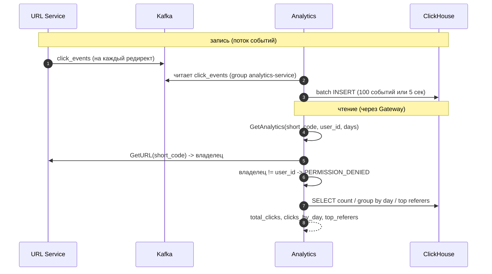

# Неделя 4: Analytics Service + ClickHouse

Вся домашка четвёртой недели в одном файле: карта → gRPC-контракт → пошаговый план. Опирается на монорепо первых трёх недель. Click events в topic `click_events` уже шлёт URL Service (третья неделя).

> Boilerplate этой недели лежит в скачанном шаблоне: `../url-shortener-template/week4/boilerplates/` (ниже для краткости — просто `boilerplates/`). Копируешь оттуда в свой репозиторий. Подробнее: [README, «С чего начать»](../README.md#с-чего-начать).

## Цель

Создать Analytics Service: Kafka consumer читает события кликов и пишет их в ClickHouse, а по gRPC отдаёт агрегированную аналитику по ссылке. Gateway проксирует REST-ручку аналитики.

---

## Что строим

- **ClickHouse** — колоночная БД, заточенная под аналитические запросы (`count`, `GROUP BY`) по большим объёмам. Сюда складываем клики.
- **Analytics Service**:
  - **consumer** — читает topic `click_events` из Kafka (consumer group `analytics-service`), копит батч и пачкой вставляет в ClickHouse;
  - **gRPC-метод `GetAnalytics`** — считает агрегаты по `short_code` и отдаёт их.
- **Gateway** проксирует `GET /api/v1/analytics/:code` → `Analytics.GetAnalytics` (как остальные ручки: получает `user_id` из проверенного токена и передаёт в gRPC).
- **Проверка владельца**: у Analytics нет доступа к MongoDB (это БД URL Service). Поэтому Analytics зовёт `URL.GetURL(short_code)`, берёт оттуда владельца и сверяет с `user_id` из запроса.

Аналитика по ссылке: `total_clicks`, `clicks_by_day` (по дням), `top_referers` (топ источников переходов).



---

## gRPC-контракт `AnalyticsService`

Опишешь сам в `shared/proto/analytics/v1/analytics.proto` (Шаг 4). Один метод:

**GetAnalytics**
- Запрос: `short_code` (string), `user_id` (string — от Gateway), `days` (int32 — окно в днях, по умолчанию 30, максимум 365)
- Ответ: `short_code` (string), `total_clicks` (int64), `clicks_by_day` (`repeated DayClicks`), `top_referers` (`repeated RefererClicks`)
  - `DayClicks`: `date` (string, `YYYY-MM-DD`), `clicks` (int64)
  - `RefererClicks`: `referer` (string), `clicks` (int64)
- Ошибки: `NOT_FOUND` (ссылка не найдена), `PERMISSION_DENIED` (не владелец)
- Поведение: `URL.GetURL(short_code)` → сверить владельца с `user_id` → выполнить SQL-запросы в ClickHouse → собрать ответ.

---

## Что нужно сделать (пошагово)

Код пишешь сам; команды/конфиги можно копировать. Ответы для самопроверки — в [`answers.md`](answers.md).

### Шаг 1. Добавить сервис `analytics` в монорепо

1. Создай модуль и папки:
   ```bash
   mkdir -p analytics/cmd analytics/internal shared/proto/analytics/v1
   (cd analytics && go mod init github.com/yourname/url-shortener/analytics)
   ```
2. Добавь `./analytics` в `go.work`.
3. Скопируй `boilerplates/analytics/.env.template` → `analytics/.env`.

**Проверка:** `go work sync` без ошибок.

### Шаг 2. Поднять ClickHouse

Добавь в корневой `docker-compose.yml`:
```yaml
clickhouse:
  image: clickhouse/clickhouse-server:24.8
  ports:
    - "8123:8123"   # HTTP-интерфейс
    - "9000:9000"   # native-протокол (по нему ходит Go-драйвер)
  volumes:
    - clickhouse_data:/var/lib/clickhouse
  ulimits:
    nofile: { soft: 262144, hard: 262144 }
```
и `clickhouse_data:` в секцию `volumes:`. Подними: `make up`.

**Проверка:**
```bash
docker compose exec clickhouse clickhouse-client --query "SELECT version()"
```

### Шаг 3. Таблица `click_events` в ClickHouse

DDL:
```sql
CREATE TABLE IF NOT EXISTS click_events (
    short_code  String,
    user_id     String,
    clicked_at  DateTime,
    ip          String,
    user_agent  String,
    referer     String
) ENGINE = MergeTree()
PARTITION BY toYYYYMM(clicked_at)
ORDER BY (short_code, clicked_at);
```
- `MergeTree` — основной движок ClickHouse.
- `PARTITION BY toYYYYMM(clicked_at)` — данные бьются по месяцам (старые партиции легко дропать).
- `ORDER BY (short_code, clicked_at)` — сортировка/первичный ключ: запросы по `short_code` за период идут быстро.

Создавай таблицу при старте сервиса (выполни этот `CREATE TABLE IF NOT EXISTS` из Go через драйвер).

**Проверка:**
```bash
docker compose exec clickhouse clickhouse-client --query "SHOW CREATE TABLE click_events"
```

### Шаг 4. Описать `.proto` и сгенерировать код

Создай `shared/proto/analytics/v1/analytics.proto`, опиши `AnalyticsService` с методом `GetAnalytics` по контракту выше. Заголовок:
- `syntax = "proto3";`, `package analytics.v1;`
- `option go_package = "github.com/yourname/url-shortener/shared/pkg/proto/analytics/v1;analytics_v1";`

Сгенерируй: `make proto-gen`. Эталон — в [`answers.md`](answers.md).

**Проверка:** появились файлы в `shared/pkg/proto/analytics/v1/`; `go build ./...` проходит.

### Шаг 5. Конфиг (свой пакет `config`)

`analytics/.env`:

| Переменная | Что это | Пример |
|------------|---------|--------|
| `KAFKA_BROKERS` | адрес(а) брокера Kafka | `localhost:9092` |
| `CLICKHOUSE_ADDR` | адрес ClickHouse (native-протокол) | `localhost:9000` |
| `CLICKHOUSE_DB` | база в ClickHouse | `default` |
| `URL_SERVICE_ADDR` | адрес gRPC URL Service (для проверки владельца) | `localhost:50052` |
| `ANALYTICS_SERVICE_PORT` | порт gRPC Analytics Service | `50053` |

Сделай пакет `analytics/internal/config` (`Config` + `Load()`, godotenv + os.Getenv + проверка обязательных), как в прошлых неделях.

**Проверка:** `config.Load()` отдаёт заполненный конфиг.

### Шаг 6. Kafka consumer → ClickHouse

1. Reader на `github.com/segmentio/kafka-go` с `GroupID: "analytics-service"`, topic `click_events`.
2. Цикл: читай сообщения, парси JSON в структуру `ClickEvent` (поля как в событии: short_code, user_id, clicked_at, ip, user_agent, referer), копи в батч.
3. Когда в батче 100 событий **или** прошло 5 секунд — вставь батч в ClickHouse и **только после успешной вставки** закоммить offset'ы.
   ```go
   r := kafka.NewReader(kafka.ReaderConfig{
       Brokers: cfg.KafkaBrokers, Topic: "click_events", GroupID: "analytics-service",
   })
   msg, err := r.FetchMessage(ctx)        // читаем без авто-коммита
   // ... накопили батч, вставили в ClickHouse ...
   r.CommitMessages(ctx, msgs...)         // коммитим offset после успешной вставки
   ```
   Batch insert в ClickHouse (`clickhouse-go/v2`):
   ```go
   batch, _ := conn.PrepareBatch(ctx, "INSERT INTO click_events (short_code, user_id, clicked_at, ip, user_agent, referer)")
   for _, e := range events { batch.Append(e.ShortCode, e.UserID, e.ClickedAt, e.IP, e.UserAgent, e.Referer) }
   batch.Send()
   ```

> Это **at-least-once**: если сервис упадёт между вставкой и коммитом offset'а, батч перечитается и события задвоятся — счётчики кликов слегка завысятся. Для пет-проекта приемлемо. В проде от дублей защищаются (например, `ReplacingMergeTree` или идемпотентный ключ).

**Проверка:** сделай несколько `GET /{code}` через Gateway (третья неделя) → в ClickHouse появляются строки:
```bash
docker compose exec clickhouse clickhouse-client --query "SELECT count() FROM click_events"
```

### Шаг 7. Слои и `GetAnalytics`

```
analytics/internal/
├── config/      # Config + Load()
├── consumer/    # Kafka consumer (Шаг 6)
├── repository/  # ClickHouse: Insert(батч) + запросы аналитики
├── client/      # gRPC-клиент к URL Service (GetURL)
├── service/     # GetAnalytics: проверка владельца + запросы
└── handler/     # gRPC-обработчик AnalyticsService
```

`GetAnalytics`:
1. `URL.GetURL(short_code)` через клиент. `NOT_FOUND` → отдать `NOT_FOUND`.
2. Если `владелец != user_id` из запроса → `PERMISSION_DENIED`.
3. Выполни три SQL-запроса в ClickHouse (окно — `days`, по умолчанию 30):
   ```sql
   -- total
   SELECT count() FROM click_events WHERE short_code = ?;

   -- by day
   SELECT toDate(clicked_at) AS d, count() AS c
   FROM click_events
   WHERE short_code = ? AND clicked_at >= now() - INTERVAL ? DAY
   GROUP BY d ORDER BY d DESC;

   -- top referers
   SELECT referer, count() AS c
   FROM click_events
   WHERE short_code = ? AND clicked_at >= now() - INTERVAL ? DAY
   GROUP BY referer ORDER BY c DESC LIMIT 10;
   ```
4. Собери ответ.

**Проверка:** `go build ./...` проходит.

### Шаг 8. Сборка в main.go (composition root)

`analytics/cmd/main.go` собирает снизу вверх:
1. `cfg := config.Load()`.
2. Подключение к ClickHouse (`clickhouse-go/v2`), `Ping`; выполни `CREATE TABLE IF NOT EXISTS` (Шаг 3).
3. Kafka reader; gRPC-клиент к URL Service.
4. `repo := repository.New(chConn)`; `urlClient := client.New(...)`; `svc := service.New(repo, urlClient)`; `h := handler.New(svc)`.
5. Запусти consumer в отдельной горутине (`go consumer.Run(ctx)`).
6. `grpcServer := grpc.NewServer()`; зарегистрируй `analyticsv1.RegisterAnalyticsServiceServer(grpcServer, h)`; `reflection.Register(grpcServer)`; слушай `cfg.GRPCPort`.
7. Graceful shutdown по SIGINT/SIGTERM: останови consumer (отмена ctx), `grpcServer.GracefulStop()`, закрой ClickHouse и Kafka reader.

> `make run`/`make test` из первой недели — про User Service. Analytics запускай `go run ./analytics/cmd`, тесты — `go test -race ./analytics/...`.

### Шаг 9. Расширить Gateway: REST-ручка аналитики

В Gateway (третья неделя) добавь:
1. Переменную `ANALYTICS_SERVICE_ADDR=localhost:50053` в `gateway/.env` и в `config`; gRPC-клиент к Analytics.
2. Защищённую ручку `GET /api/v1/analytics/{code}` (под auth-middleware). Query `days` (по умолчанию 30). Хендлер берёт `user_id` из контекста (middleware), зовёт `Analytics.GetAnalytics(code, user_id, days)`, мапит ответ в JSON:
   ```json
   {
     "short_code": "abc1234",
     "total_clicks": 1542,
     "clicks_by_day": [ {"date": "2026-01-15", "clicks": 234} ],
     "top_referers": [ {"referer": "https://t.me", "clicks": 523} ]
   }
   ```
   Ошибки gRPC → HTTP по той же таблице (404, 403, 401).

**Проверка:** `curl -H 'Authorization: Bearer <access>' 'localhost:8080/api/v1/analytics/<code>?days=30'` отдаёт аналитику.

### Шаг 10. Тесты

- Unit: формирование SQL-запросов / маппинг строк ClickHouse в ответ (мок repository).
- Интеграционный (`testcontainers`, ClickHouse): вставить события → вызвать `GetAnalytics` → проверить агрегаты.

**Проверка:** `go test -race ./analytics/...` зелёный.

---

## Чек-лист

- [ ] `make up` поднимает Postgres + Redis + MongoDB + Kafka + ClickHouse
- [ ] `make proto-gen` генерирует код из `shared/proto/analytics/v1/analytics.proto`
- [ ] Consumer читает `click_events` (group `analytics-service`) и вставляет батчами в ClickHouse
- [ ] Таблица `click_events` — `MergeTree`, партиционирование по месяцу
- [ ] `GetAnalytics` проверяет владельца через `URL.GetURL`, иначе `PERMISSION_DENIED`/`NOT_FOUND`
- [ ] `GetAnalytics` возвращает `total_clicks`, `clicks_by_day`, `top_referers` за окно `days`
- [ ] Gateway проксирует `GET /api/v1/analytics/{code}` в Analytics
- [ ] Unit + интеграционный тест проходят

## Подсказки

- ClickHouse-драйвер: `github.com/ClickHouse/clickhouse-go/v2`
- Kafka: `github.com/segmentio/kafka-go`
- gRPC-клиент к URL: адрес из env `URL_SERVICE_ADDR`
- Testcontainers (ClickHouse-модуль): `github.com/testcontainers/testcontainers-go/modules/clickhouse`
