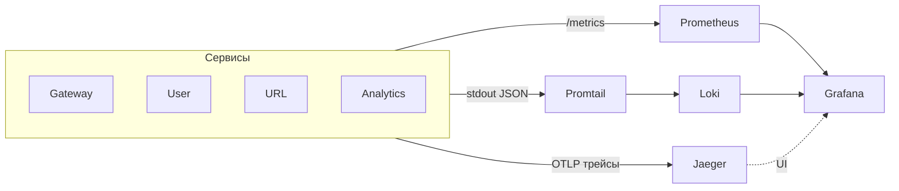

# Неделя 5: Observability + Docker + CI/CD + нагрузочное

Финальная неделя: к готовым четырём сервисам добавляем наблюдаемость (метрики, трейсы, логи), профилирование, упаковываем всё в Docker, поднимаем одним `docker compose`, настраиваем CI и прогоняем нагрузочный тест.

> Boilerplate этой недели лежит в скачанном шаблоне: `../url-shortener-template/week5/boilerplates/` (ниже для краткости — просто `boilerplates/`). Копируешь оттуда в свой репозиторий. Подробнее — в начале проекта, раздел «С чего начать».

## Цель

Сделать проект «прод-готовым»: видно метрики и трейсы запросов, логи коррелируются с трейсами, все сервисы в Docker, один `docker compose up` поднимает весь стек, CI на каждый PR гоняет lint+test+build.

---

## Что строим

К стеку (Postgres, Redis, Mongo, Kafka, ClickHouse + 4 сервиса) добавляем:
- **Prometheus** — собирает метрики со всех сервисов; **Grafana** — рисует дашборды.
- **Jaeger** — хранит и показывает распределённые трейсы (один запрос через все сервисы).
- **Loki** + **Promtail** — собирают логи контейнеров; смотрим их в той же Grafana.
- **pprof** — профилирование (CPU/heap/goroutine) каждого сервиса.

Каждый сервис поднимает рядом с gRPC/HTTP **ops-сервер** (обычный `http.Server`) на отдельном порту — на нём `/metrics` (для Prometheus) и `/debug/pprof/` (для pprof).



> **Важно про сгенерированный proto-код.** Начиная с этой недели мы **коммитим** `shared/pkg/proto/**` в git (он не в `.gitignore`). Тогда свежий клон и CI собираются обычным `go build`, без установки `buf`. Регенерируешь локально (`make proto-gen`) — закоммить результат.

---

## Что нужно сделать (пошагово)

Команды/конфиги можно копировать; код пишешь сам.

### Шаг 1. Ops-сервер: метрики (Prometheus + Grafana)

1. В каждый сервис добавь второй HTTP-сервер на `METRICS_PORT` (в compose у всех `9090`, локально — разные, чтобы не конфликтовали). На нём:
   - `/metrics` — хендлер `promhttp.Handler()` (`github.com/prometheus/client_golang`).
2. Заведи и инкрементируй метрики (`prometheus.NewCounterVec` / `NewHistogramVec`), как минимум:
   - Gateway: `http_requests_total{method,path,status}`, `http_request_duration_seconds` (histogram).
   - gRPC-сервисы: `grpc_requests_total{method,status}`, `grpc_request_duration_seconds` (histogram) — удобно через gRPC-interceptor.
   - URL: `links_created_total`, `redirects_total`, `kafka_messages_produced_total`.
   - Analytics: `kafka_messages_consumed_total`, `clickhouse_batch_insert_duration_seconds`.
3. Добавь в compose `prometheus` и `grafana` (конфиг — `boilerplates/prometheus/prometheus.yml`, он скрейпит `user:9090`, `url:9090`, `gateway:9090`, `analytics:9090`). В Grafana добавь datasource Prometheus и импортируй `boilerplates/grafana/dashboard.json`.

**Проверка:** `curl localhost:9090/metrics` у сервиса отдаёт метрики; в Grafana (`localhost:3000`) на дашборде видны RPS/латентность после пары запросов.

### Шаг 2. Трейсинг: OpenTelemetry → Jaeger

1. Подключи OTel SDK (`go.opentelemetry.io/otel`, экспортер `.../exporters/otlp/otlptrace/otlptracegrpc`). На старте сервиса настрой `TracerProvider`, который шлёт трейсы по OTLP в Jaeger (`OTEL_EXPORTER_OTLP_ENDPOINT`, в compose — `jaeger:4317`).
2. Инструментируй вызовы автоматически:
   - gRPC: `otelgrpc` — `grpc.NewServer(grpc.StatsHandler(otelgrpc.NewServerHandler()))` и на клиентах `otelgrpc.NewClientHandler()`.
   - HTTP (Gateway): обёртка `otelhttp.NewHandler(router, "gateway")`.
   Так trace context автоматически пробрасывается между сервисами.
3. Добавь в compose `jaeger` (`jaegertracing/all-in-one`, `COLLECTOR_OTLP_ENABLED=true`, UI на `16686`).

**Проверка:** сделай `POST /api/v1/urls` через Gateway → в Jaeger UI (`localhost:16686`) виден один трейс со спанами Gateway → User.ValidateSession → URL.CreateShortURL → User.GetLimit.

### Шаг 3. Логи: slog (JSON) + trace_id → Loki

1. Переведи все логи на `log/slog` с JSON-хендлером (`slog.NewJSONHandler(os.Stdout, ...)`).
2. В каждый лог добавляй `trace_id` из контекста — бери его из активного спана:
   ```go
   sc := trace.SpanContextFromContext(ctx)
   if sc.HasTraceID() {
       logger = logger.With("trace_id", sc.TraceID().String())
   }
   ```
   Так лог в Grafana кликом связывается с трейсом в Jaeger.
3. Добавь в compose `loki` и `promtail` (Promtail читает stdout контейнеров и шлёт в Loki; конфиг — `boilerplates/promtail/promtail.yml`). В Grafana добавь datasource Loki.

**Проверка:** в Grafana → Explore → Loki видно JSON-логи с полем `trace_id`; по нему находится тот же запрос.

### Шаг 4. pprof

Подключи `net/http/pprof` к ops-серверу из Шага 1 (импорт `_ "net/http/pprof"` регистрирует хендлеры на `/debug/pprof/`). Отдельный порт не нужен — это тот же ops-сервер, что и `/metrics`.

**Проверка:** `go tool pprof http://localhost:9090/debug/pprof/heap` открывает профиль; `curl localhost:9090/debug/pprof/goroutine?debug=1` отдаёт стек горутин.

### Шаг 5. Нагрузочное тестирование (k6)

1. Напиши k6-сценарий (`load/script.js`): 100 виртуальных пользователей, 30 секунд. Сценарий: Register → Login → создать 10 ссылок → пройти по каждой (redirect).
2. Запусти: `k6 run load/script.js`.
3. Зафиксируй RPS, p50/p95/p99 latency, error rate. Сопоставь с графиками в Grafana во время прогона.

**Проверка:** k6 отрабатывает 30 сек, в отчёте есть p95/p99 и error rate; в Grafana видно всплеск RPS и латентности.

### Шаг 6. Dockerfile (multi-stage)

На каждый сервис — multi-stage Dockerfile. Build-контекст = корень репозитория (нужны `go.work` + `shared`). Шаблон (`boilerplates/Dockerfile.service`, подставь `<service>`):
```dockerfile
# --- build ---
FROM golang:1.23-alpine AS build
WORKDIR /src
COPY go.work go.work.sum ./
COPY shared/ ./shared/
COPY user/ ./user/
COPY url/ ./url/
COPY gateway/ ./gateway/
COPY analytics/ ./analytics/
RUN cd <service> && CGO_ENABLED=0 go build -trimpath -ldflags="-s -w" -o /bin/app ./cmd

# --- run ---
FROM alpine:3.20
RUN adduser -D -u 10001 app
USER app
COPY --from=build /bin/app /bin/app
ENTRYPOINT ["/bin/app"]
```
`CGO_ENABLED=0` даёт статический бинарь; `alpine` + `-s -w` → образ ~15-20 MB. `USER app` — не root.

**Проверка:** `docker build -f user/Dockerfile -t us/user .` собирается; `docker images us/user` показывает < 20 MB.

### Шаг 7. Финальный docker-compose

Один `docker-compose.yml` поднимает всё:
- инфраструктура: `postgres`, `mongo`, `redis`, `kafka`, `clickhouse`;
- сервисы: `user`, `url`, `gateway`, `analytics` (каждый со своим `build:` и `env_file: ./<service>/.env`, плюс адреса соседей по compose-сети, напр. `USER_SERVICE_ADDR=user:50051`);
- наблюдаемость: `prometheus`, `grafana`, `jaeger`, `loki`, `promtail`.

> Внутри compose-сети адреса — это имена сервисов, а не `localhost`. То есть в env сервисов для compose `USER_SERVICE_ADDR=user:50051`, `KAFKA_BROKERS=kafka:9092`, `REDIS_HOST=redis` и т.д. (для локального `go run` — `localhost`). Удобно держать отдельный `.env` для compose или переопределять переменные в `environment:`.

**Проверка:** `docker compose up` поднимает 13+ контейнеров; полный сценарий (register → login → create → redirect → analytics) проходит через `localhost:8080`.

### Шаг 8. CI/CD: GitHub Actions

Файл `.github/workflows/ci.yml` (шаблон — `boilerplates/.github/workflows/ci.yml`). Так как сгенерированный proto закоммичен, CI не ставит `buf` — просто собирает. На каждый push/PR:
- `golangci-lint` по каждому модулю (`user`, `url`, `gateway`, `analytics`);
- `go test -race ./...` по каждому модулю;
- `docker build` каждого сервиса.

На push в `main` — дополнительно build+push образов в GitHub Container Registry (`ghcr.io`).

**Проверка:** открой PR → во вкладке Checks все джобы (lint, test, build) зелёные.

### Шаг 9. README

Допиши корневой `README.md`: архитектурная схема, краткое описание каждого сервиса, ссылка на контракты (`weekN/hw.md`), инструкция «`docker compose up` и `curl ...`», скриншот дашборда Grafana.

**Проверка:** по README человек с нуля поднимает проект и делает первый запрос.

---

## Чек-лист

- [ ] `docker compose up` поднимает весь стек (инфра + 4 сервиса + Prometheus/Grafana/Jaeger/Loki/Promtail)
- [ ] У каждого сервиса есть `/metrics`; в Grafana дашборд с RPS/латентностью/ошибками
- [ ] В Jaeger виден сквозной трейс одного запроса через все сервисы
- [ ] Логи — JSON `slog` с `trace_id`; в Grafana → Loki ищутся по trace_id
- [ ] pprof доступен на ops-порту (`/debug/pprof/`)
- [ ] Нагрузочный тест k6 прогнан, зафиксированы RPS и p95/p99
- [ ] Multi-stage Dockerfile у каждого сервиса, образ < 20 MB, non-root
- [ ] CI (GitHub Actions): lint + test + build зелёные на PR
- [ ] Сгенерированный proto закоммичен (CI собирается без buf)
- [ ] README с инструкцией и скриншотом

## Подсказки

- Метрики: `github.com/prometheus/client_golang`
- OpenTelemetry: `go.opentelemetry.io/otel`, `go.opentelemetry.io/contrib/instrumentation/google.golang.org/grpc/otelgrpc`, `.../net/http/otelhttp`
- slog: стандартная `log/slog`; trace_id — `go.opentelemetry.io/otel/trace`
- Нагрузка: k6 (`https://k6.io`, скрипт на JS) или vegeta (`github.com/tsenart/vegeta`)
- Loki/Promtail: образы `grafana/loki`, `grafana/promtail`
